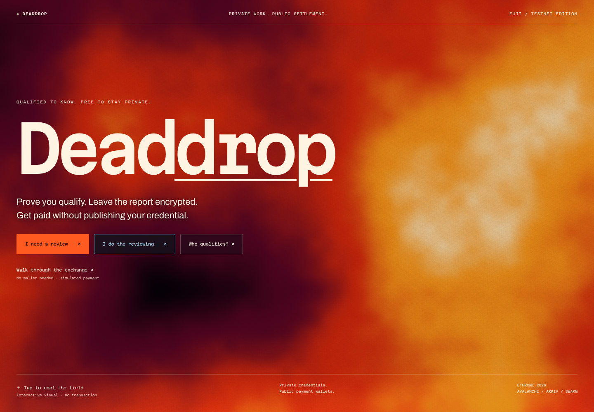
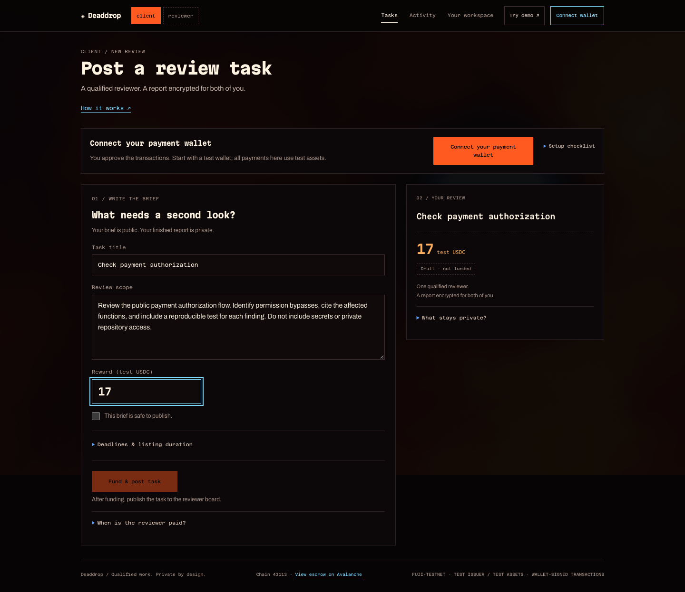

# Deaddrop



**Fund a review. Keep the report private. Pay for the work.**

Deaddrop lets a team fund a technical review in USDC, lets a reviewer accept with a private proof of enrollment, and delivers an encrypted report. The client opens the report and approves payment; Avalanche settles it. Wallets and payments remain public.

[Open Deaddrop](https://cutout-ethrome-2026.vercel.app) · [Interactive demo](https://cutout-ethrome-2026.vercel.app/?view=demo) · [Project brief](PROJECT_BRIEF.md) · [Quickstart](docs/deaddrop/QUICKSTART.md) · [User flow](docs/deaddrop/USER-FLOW.md) · [Architecture](docs/deaddrop/ARCHITECTURE.md) · [Bounties](docs/deaddrop/BOUNTIES.md) · [Docs index](docs/README.md)

The product was previously called Cutout. The app URL and browser storage namespaces are retained so existing participants keep their private keys. [Rebrand and bounty decisions](docs/design/deaddrop/README.md).

## Submission release

Automatic enrollment removes the manual reviewer approval gate in this revision. Hosted automatic issuance and a fresh first-time paid flow still require release verification; the receipts below cover the earlier saved-pass flow.

The default repository commands now run Deaddrop. The final app includes the complete thermal landing, product explanation, lifecycle and FAQs. A new public review, **task #6**, completed browser proof → Fuji acceptance → encrypted Swarm delivery → client decryption → **0.1 test USDC payment**. Original browser keys and saved passes survived the release. [Release evidence](docs/deaddrop/evidence/submission/README.md), including clean-checkout builds, hosted checks and finalized receipts.

## Problem first

A team needs a second pair of eyes on a sensitive change: “Can an unauthorized wallet withdraw after this permissions update?” It wants a reviewer and a funded agreement. The reviewer should not have to publish a reusable credential identifier for every small engagement, and the resulting report should stay between the participants.

Deaddrop separates those responsibilities. An issuer automatically enrolls the reviewer. A proof checks their valid pass without revealing the credential. The client evaluates the work. An escrow holds and pays the reward.

The first use case is a focused technical review, not a replacement for a full security audit. Enrollment is open and does not assess technical expertise. Assessed credentials from external issuers are a future integration; customer demand still needs validation.

## How it works

1. **Fund a task.** The client writes a public scope and locks test USDC on Avalanche Fuji. A separate Arkiv transaction lists the task for discovery.
2. **Choose work.** The reviewer connects their wallet and opens a task. First-time setup requests a wallet signature and obtains a private reviewer pass automatically. No team approval or credential files are needed.
3. **Prove eligibility.** The reviewer proves, in their browser, that the required credential is valid and unrevoked. The proof is bound to this task and wallet. Fuji verifies it when they accept.
4. **Seal the report.** The browser encrypts the report for the client and reviewer, uploads ciphertext to Swarm, and checks retrieval. A Fuji transaction commits its reference and hash.
5. **Open and pay.** The client retrieves and decrypts the report, then approves payment to the assigned reviewer.

Read the [complete user flow](docs/deaddrop/USER-FLOW.md) for qualification issuance, wallet roles, deadlines and disputes.



*Actual hosted application capture, 13 September 2026; the visible scope is an unfunded draft. For current deployment and verification scope, see [evidence](docs/deaddrop/EVIDENCE.md).*

## Try it

**No setup:** the [guided demo](https://cutout-ethrome-2026.vercel.app/?view=demo) walks through a review in about three minutes. Browser encryption and decryption are real; qualification, funding and payment are explicitly simulated, and the walkthrough does not upload to Swarm.

**Real testnet work:** the [live workspace](https://cutout-ethrome-2026.vercel.app) uses deployed Fuji contracts, public Arkiv discovery and public Swarm storage. A paid review needs two wallet roles, test funds, registered browser report keys and a private reviewer pass obtained automatically in the app. Storage requires no customer Swarm account. Follow the [end-to-end test](docs/deaddrop/TESTING.md).

**Run the frontend locally:**

```sh
git clone --branch main https://github.com/MihRazvan/eth-rome-2026.git
cd eth-rome-2026
npm ci
npm run dev
```

Open **http://127.0.0.1:18904/?view=demo**. Requires Node 24.12+. This starts the UI walkthrough; the live workspace requires a configured backend. The [quickstart](docs/deaddrop/QUICKSTART.md) covers the full local chain/storage rehearsal and verification. `npm run build` creates the standalone interface; `npm run build:hosting` prepares the verified public API deployment.

## Why these technologies

| Layer | Technology | Responsibility |
| --- | --- | --- |
| Settlement | **Avalanche Fuji + Solidity + test USDC** | Hold rewards, enforce proof-bound assignment, commit delivery and settle payment |
| Discovery | **Arkiv Tiramisu** | Wallet-owned, queryable task listings with native expiry and WebSocket updates |
| Documents | **Swarm / Bee HTTP** | Public scopes and issuer snapshots; recipient-encrypted reports |
| Qualification | **gnark Groth16 on BN254, Go → WebAssembly** | Prove a valid issuer-signed pass and current nonrevocation locally; verify onchain |
| Report privacy | **WebCrypto + HPKE** | Encrypt locally and wrap document keys separately for each recipient |
| Product | **TypeScript + Vite; Vercel** | Deaddrop interface, browser proving worker, public reads and automatic enrollment |

The [architecture](docs/deaddrop/ARCHITECTURE.md) maps each boundary to source. The [security model](docs/deaddrop/SECURITY.md) explains exactly what remains trusted or public.

## Bounty targets

| Sponsor | Entry | Where to inspect |
| --- | --- | --- |
| Avalanche / Team1 | Track A — stablecoin payments for technical reviews | [Integration and demo proof](docs/deaddrop/bounties/AVALANCHE.md) |
| Arkiv | Mission 02, Mission 03; Best Use consideration | [Queries, expiry, subscriptions and feedback](docs/deaddrop/bounties/ARKIV.md) |
| Swarm | Useful decentralized document storage | [Encryption, upload and retrieval](docs/deaddrop/bounties/SWARM.md) |

We enter one Team1 track. Arkiv awards are not additive per team. These are targets, not claims that eligibility or awards have been confirmed. [Requirements and remaining submission items](docs/deaddrop/BOUNTIES.md).

Reviewer enrollment is open; a pass confirms participation, not assessed expertise. Passes persist privately in the browser. Files are optional backups or a one-time migration path. [Automatic enrollment and private proofs](docs/deaddrop/QUALIFICATION.md).

## What is verified

**A complete public review has settled:** task #4 funded, accepted with a browser proof from a saved pass, delivered through encrypted Swarm storage, opened by the client and paid on Fuji. The reviewer received **0.1 test USDC**, reconciled against finalized receipts and token balances. Real two-browser Arkiv publication and native expiry were also exercised. [Receipts and browser evidence](docs/deaddrop/evidence/saved-pass/README.md).

These checks used operator-owned test wallets in actual Chromium profiles. Independent teammate extension-wallet review and the final presentation video remain separate. The [evidence index](docs/deaddrop/EVIDENCE.md) distinguishes public transactions, local tests and the simulated walkthrough.

## Deployments

Avalanche Fuji C-Chain, **43113**. Links open exact-runtime source verification records.

| Contract | Address |
| --- | --- |
| Qualification escrow | [0xb431e570d506168711cc1f9f91e325b3114c62af](https://repo.sourcify.dev/43113/0xb431e570d506168711cc1f9f91e325b3114c62af) |
| Groth16 verifier | [0x9c1293e7e499d56fdc52186e7624dcfa04dfcbd1](https://repo.sourcify.dev/43113/0x9c1293e7e499d56fdc52186e7624dcfa04dfcbd1) |
| Document-key registry | [0x181db4e48a0e76fdc50101085ac3b831464792c1](https://repo.sourcify.dev/43113/0x181db4e48a0e76fdc50101085ac3b831464792c1) |

Payment token: canonical Fuji test USDC, `0x5425890298aed601595a70AB815c96711a31Bc65`. [Public manifest, network details and hosting instructions](docs/deaddrop/DEPLOYMENT.md).

## Explore the repository

| Path | Contents |
| --- | --- |
| [experiments/qualification/pilot/web](experiments/qualification/pilot/web) | Current Deaddrop frontend and guided demo |
| [experiments/qualification/pilot](experiments/qualification/pilot) | Wallets, encryption, Arkiv, Swarm, browser prover and hosting |
| [experiments/qualification/contracts](experiments/qualification/contracts) | Qualification escrow, document keys and contract tests |
| [experiments/qualification/prover](experiments/qualification/prover) | Circuit, issuer registry, native/Go WASM prover |
| [docs](docs/README.md) | Product, developer, presenter, sponsor and evidence paths |
| [arkiv](arkiv) | Data schema and submission evidence matrix |

Deaddrop was built during ETHRome 2026. Deployed `review-pass` protocol domains and existing browser storage names remain stable for compatibility. Superseded product experiments and internal planning are preserved in Git history. The [MIT license](LICENSE), [asset licenses](experiments/qualification/pilot/web/assets/README.md), dependency licenses and original commit history remain intact.
