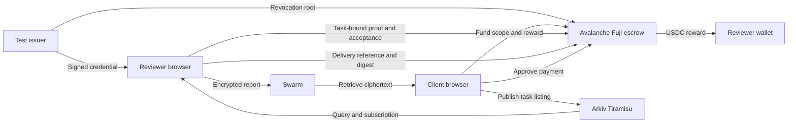

# Cutout — technical architecture

[Docs](../README.md) · [User flow](USER-FLOW.md) · [Security](SECURITY.md) · [Deployment](DEPLOYMENT.md)

Cutout has three public infrastructure responsibilities: Avalanche determines task and payment state, Arkiv provides discovery, and Swarm carries documents. The participant's browser holds the private inputs and performs proving and encryption. The document read API has no financial signer. A separate enrollment endpoint relays encrypted applications to Arkiv with an operator-funded gas key; credential signing remains with the offline issuer.

## Data path

The public scope and whole issuer snapshot also live on Swarm. The snapshot's root is checked against the escrow; the scope and report are checked against their task's committed digest.

## Qualification relation

The reviewer receives an EdDSA-signed credential covering a holder commitment, allocated revocation index, qualification class and expiry. The browser proves knowledge of that signature and the holder secret, verifies a depth-16 Merkle nonrevocation path at the same index, and binds the presentation to its task context and receiving wallet.

The implementation uses gnark Groth16 over BN254. The same Go relation runs natively and through a Go WebAssembly worker. Public proving artifacts are downloaded to the browser; private inputs are not sent to a remote prover. It is an experimental construction inspired by the private-qualification research direction, not an implementation of ShadowPath.

| Public verifier input | Purpose |
| --- | --- |
| Issuer X, issuer Y | Credential signing authority |
| Status root | Current issuer revocation state |
| Qualification class | Required eligibility category |
| Proof deadline | Limit presentation validity |
| Task context | Bind presentation to this chain, contract and assignment |
| Recipient | Bind acceptance to the payment wallet |
| Nullifier | Prevent the prohibited reuse encoded by the relation/escrow |
| Presentation tag | Bind the presentation's public context |

The credential signature, actual credential expiry, holder secret/commitment, revocation index and Merkle path are private witnesses. Full details are in the [circuit](../../experiments/qualification/prover/circuit.go) and [presenter technical appendix](../CUTOUT-PRESENTER-GUIDE.md). The wallet and task remain public, so reusing a wallet still links activity.

The client fetches the whole public status snapshot. The browser builds the nonrevocation witness locally, avoiding a request for one identifiable credential's status. Issuance allocates a fresh slot; revocation updates the root and requires a matching published snapshot. Freshness is checked again on acceptance.

## Settlement

The escrow records the task creator, required class, token reward, scope commitment and deadlines. Acceptance verifies the proof against the current issuer root and binds the assigned reviewer. Only that reviewer can commit delivery. Approval releases funds; deadline and dispute routes handle noncompletion or disagreement.

On Fuji, payment uses canonical Circle test USDC. Local rehearsals deploy a freely minted demo token. The team controls root updates and acts as the explicitly trusted test arbitrator. Neither role can be described as independent accreditation or trustless quality assessment.

## Discovery

An Arkiv listing advertises an existing funded task; it does not create the financial claim. Compound queries select matching public listings. Cutout authenticates the entity owner and validates task data/eligibility against finalized Fuji state before offering acceptance.

Native Arkiv expiry bounds recruitment duration. The browser listens to entity events and new heads, filters relevant changes and reconciles through queries; it has no fixed polling loop. Reconnection queries current state. Disappearance from Arkiv changes the board, not escrow rights. [Schema](../../arkiv/schema.md) and [mission explanation](bounties/ARKIV.md).

## Documents and browser keys

Each wallet registers its browser's P-256 public report key on Fuji. The nonextractable private key persists in IndexedDB under a namespace including chain, registry, wallet and browser origin. The document envelope contains task context, ciphertext and a separately wrapped content key for each recipient.

AES-GCM protects report bytes. HPKE uses P-256, HKDF-SHA256 and AES-256-GCM to wrap the content key. The app authenticates current recipient bindings before encryption, uploads only the encrypted envelope, separately retrieves it and checks SHA-256. The assigned reviewer commits that reference and digest on Fuji. Recipients verify the committed bytes before decrypting.

The active hosted adapter uses gateway-funded Bee HTTP uploads without a Swarm identity account. Swarm ID remains an optional adapter. The current upload and retrieval paths use the same gateway operator, with no guaranteed retention policy. [Swarm integration](bounties/SWARM.md).

## Code map

All paths are relative to the repository root. The `experiments/qualification` name is retained history; it contains the active product.

| Component | Implementation |
| --- | --- |
| Interface, roles and transactions | [pilot/web/main.ts](../../experiments/qualification/pilot/web/main.ts) |
| Shell and guided walkthrough | [shell.ts](../../experiments/qualification/pilot/web/shell.ts), [demo.ts](../../experiments/qualification/pilot/web/demo.ts) |
| Credential generation and validation | [holder-enrollment.ts](../../experiments/qualification/pilot/holder-enrollment.ts), [proof-files.ts](../../experiments/qualification/pilot/proof-files.ts) |
| Browser proving | [browser-prover.ts](../../experiments/qualification/pilot/browser-prover.ts), [Go circuit](../../experiments/qualification/prover/circuit.go) |
| Issuer allocation and signing | [issuer_registry.go](../../experiments/qualification/prover/issuer_registry.go), [issue-enrollment.mjs](../../experiments/qualification/pilot/issue-enrollment.mjs) |
| Escrow and report key registry | [QualificationEscrow.sol](../../experiments/qualification/contracts/src/QualificationEscrow.sol), [QualificationKeys.sol](../../experiments/qualification/contracts/src/QualificationKeys.sol) |
| Encryption and device persistence | [keys.ts](../../experiments/qualification/pilot/keys.ts) |
| Discovery, native expiry, subscriptions | [listings.ts](../../experiments/qualification/pilot/listings.ts) |
| Active Swarm gateway | [swarm-gateway.ts](../../experiments/qualification/pilot/swarm-gateway.ts) |
| Public hosting and read API | [hosting](../../experiments/qualification/pilot/hosting) |

## Hosting boundary

Vercel serves static assets and a bounded read-only Node function. It exposes public configuration, whole snapshots and task document reads. Its separate enrollment API receives signed encrypted applications and uses a narrowly purposed Arkiv relay key; it never receives holder secrets or the credential signing key. Browser wallets perform transactions, the browser worker generates proofs, and browser WebSockets connect to Arkiv directly. A source deployment manifest and matching proving artifacts are required for the active build; a missing live dependency is not replaced with fixture data.

The root Vercel configuration belongs to earlier EXIT. Cutout has an isolated build-output deployment. [Deployment instructions](DEPLOYMENT.md) explain the distinction.
